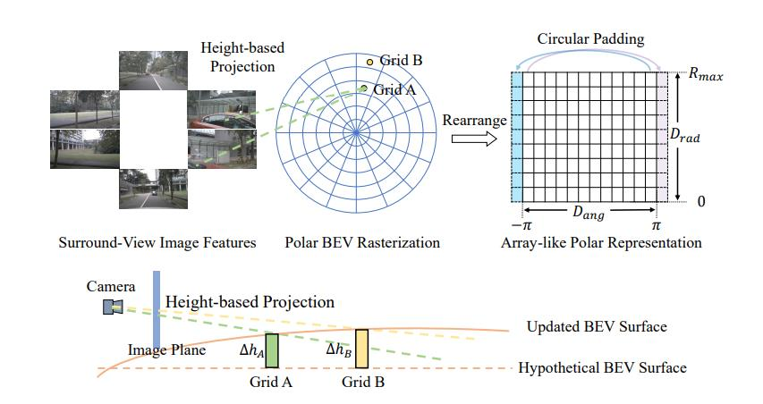

<div align="center">
<h1>PolarBEV</h1>
<h4>Vision-based Uneven BEV Representation Learning
with Polar Rasterization and Surface Estimation</h4>

Zhi Liu<sup>1,3</sup> \*  &ensp; <space> Shaoyu Chen<sup>2,3</sup> * &ensp; Xiaojie Guo<sup>1 :email:</sup> &ensp; Xinggang Wang<sup>2</sup> &ensp;
Tianheng Cheng<sup>2,3</sup>&ensp; Hongmei Zhu<sup>3</sup> &ensp; Qian Zhang<sup>3</sup>&ensp; Wenyu Liu<sup>2</sup>&ensp; Yi Zhang<sup>1</sup>

<sup>1</sup> Tianjin University &ensp; <sup>2</sup> Huazhong University of Science & Technology &ensp; <sup>3</sup> Horizon Robotics

\* represents equal contribution, <sup>:email:</sup> represents correspoding author. 

Arxiv preprint [arxiv 2207.01878](https://arxiv.org/pdf/2207.01878.pdf)
</div>

#
## Introduction
This respority contains the source code for our CoLR2022 paper "Vision-based Uneven BEV Representation Learning with Polar Rasterization and Surface Estimation".



In this work, we propose PolarBEV for vision-based uneven BEV representation learning. To adapt to the foreshortening effect of camera imaging, we
rasterize the BEV space both angularly and radially, and introduce polar embedding decomposition to model the associations among polar grids. Polar grids are
rearranged to an array-like regular representation for efficient processing. Besides,
to determine the 2D-to-3D correspondence, we iteratively update the BEV surface
based on a hypothetical plane, and adopt height-based feature transformation. PolarBEV keeps real-time inference speed on a single 2080Ti GPU, and outperforms
other methods for both BEV semantic segmentation and BEV instance segmentation. Thorough ablations are presented to validate the design.

#
## Installation
This project is adapted from [FIERY](https://github.com/wayveai/fiery), thank the authors for their excellcent work!
As for the details of installation, please refer to [requirements.txt](./requirements.txt)

#
## Data Preparation
You need to download the [nuscenes](https://www.nuscenes.org/nuscenes#download) dataset, and orgnize the directory as follows:
```
/opt/datasets/
├─ nuscenes/
│  ├─ v1.0-trainval/
│  ├─ v1.0-mini/
│  ├─ samples/
│  ├─ sweeps/
│  └─ maps/
│     ├─ basemap/
│     └─ expansion/
```

#
## Training
Run
```
python train.py --config polarbev/configs/single_timeframe.yml DATASET.DATAROOT ${NUSCENES_DATAROOT}
```

To run with different input resolution, you can change the flags 
```IMAGE.FINAL_DIM``` and ```IMAGE.RESIZE_SCALE``` to different values.
#
## Evaluation
Run
```
python evaluate.py --checkpoint ${CHECKPOINT_PATH} --dataroot ${NUSCENES_DATAROOT}
```

#
## License
This project is released under the [MIT Lincinse](./LICENSE)
#
## Citation
If you find PolarBEV is useful for your research or applications, please cite it by the following BiteX entry.
```

@article{liu2022vision,
title={Vision-based Uneven BEV Representation Learning with Polar Rasterization and Surface Estimation},
author={Liu, Zhi and Chen, Shaoyu and Guo, Xiaojie and Wang, Xinggang and Cheng, Tianheng and Zhu, Hongmei and Zhang, Qian and Liu, Wenyu and Zhang, Yi},
journal={arXiv preprint arXiv:2207.01878},
year={2022}
}

```